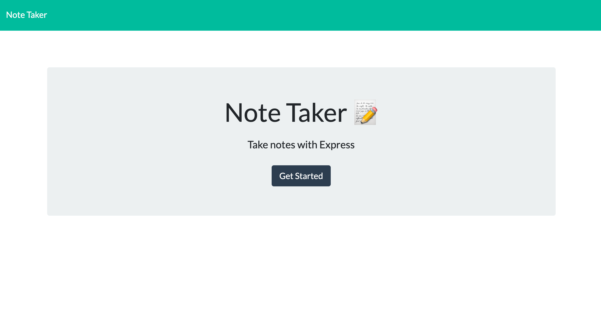

# Note-Taker

## Table of contents
* [Description](#description)
* [User Story](#userstory)
* [Screenshot](#screenshot)
* [Installation](#installation)
* [Technologies](#technologies)

## Description
A digital notepad created to save, delete, or add notes so the user can remember what they wrote down when it was important.
If you refresh the page the notes will still be there. The functionality of this app relies on the GET, POST and DELETE method.This application uses an express backend and save and retrieve note data from a JSON file.

## User Story

AS A user, I want to be able to write and save notes

I WANT to be able to delete notes I've written before

SO THAT I can organize my thoughts and keep track of tasks I need to complete

## Screenshot

## Installation

To get this project up and running follow the steps bellow.

1. Navigate to the main page of the repository
2. Under the repository name, click Clone or download
3. In the Clone with HTTPSs section, click the copy
4. Open Terminal
5. Change the current working directory to the location where you want the cloned directory to be made.
6. Type ‘git clone’ and then paste the URL you copied
	- $ git clone https://github.com/aidabyte/Note-Taker-Hw.git
7. Press Enter. Your local clone will be created.
8. open up VScode
9. run npm i in terminal

## Technologies
1. nodejs
2. express
3. postman

